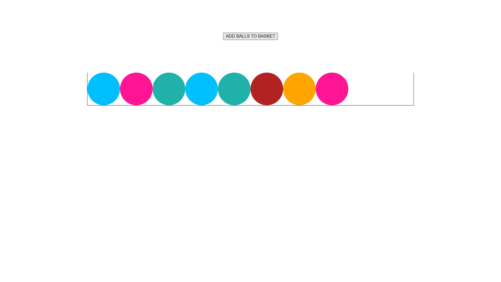
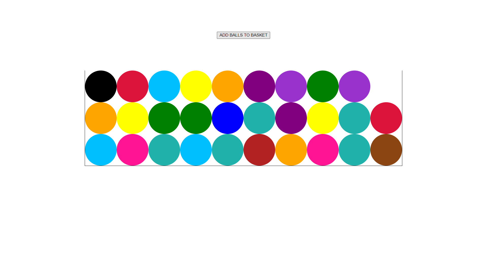

# Put Balls in the Basket

## You have been given a task to move balls to a basket. There are many balls lying on the floor scattered and needs to be put in the basket.
## The process is fully automatic and you just need to press a button to initiate the process. After pressing the button, the ball automatically gets stacked in the basket.
## The addition of a ball starts from the left side of the basket and gets stacked up as a row gets fully filled.
## The balls are picked at random by the machine and they have the following colors - 'red', 'blue', 'yellow', 'lightgrey', 'darkorchid', 'black', 'orange', 'deeppink', 'green', 'purple', 'saddlebrown', 'lightseagreen', 'deepskyblue', 'firebrick' and 'crimson'.

